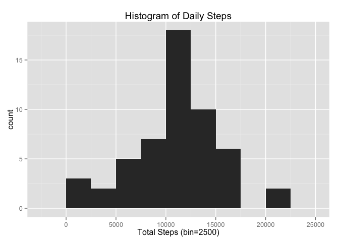
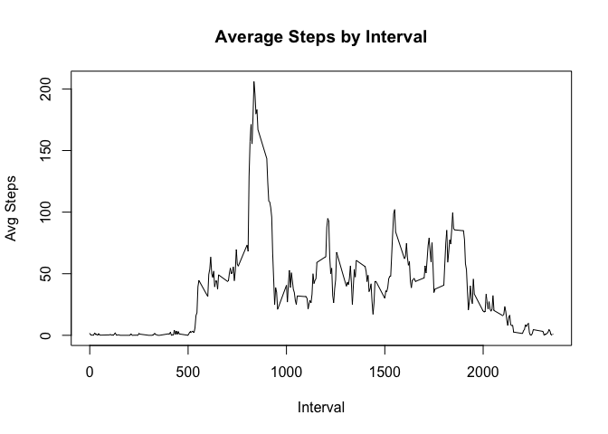
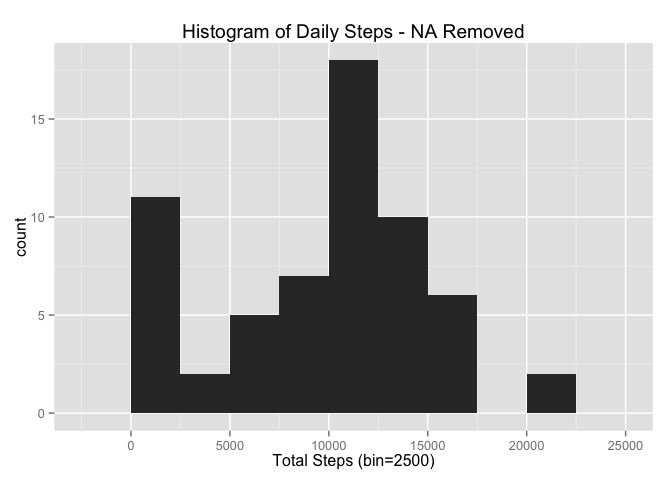
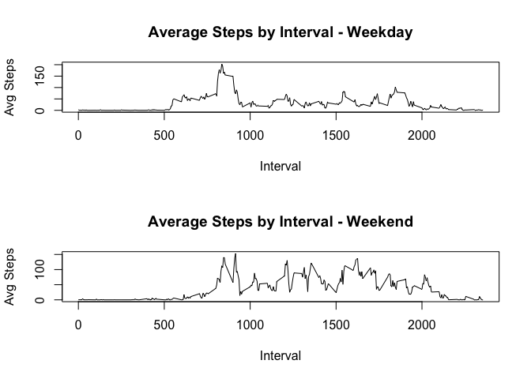

# Reproducible Research: Peer Assessment 1


## Loading and preprocessing the data
- Process The Zip File
- Load the activity.csv file to a data.frame
- Change the dates to correct format

```r
#Load the Data into 'ActData' Data Frame
ActData <- read.csv(unz('activity.zip', "activity.csv"))
ActData$date <- as.Date(ActData$date)
head(ActData)
```

```
##   steps       date interval
## 1    NA 2012-10-01        0
## 2    NA 2012-10-01        5
## 3    NA 2012-10-01       10
## 4    NA 2012-10-01       15
## 5    NA 2012-10-01       20
## 6    NA 2012-10-01       25
```

## What is mean total number of steps taken per day?
- Calculate the total steps taken in a day.
- Plot the daily steps
- Calculate the average and median numbers of steps in a day

```r
#Use ggplot2 library
library(ggplot2)

#Calculate the Sum total daily steps
daily_steps <- aggregate(steps~date,data=ActData,FUN=sum,na_rm=TRUE)

#Build the plot
daily_step_histplot <- ggplot(daily_steps,aes(x = steps)) +
                       ggtitle("Histogram of Daily Steps") +
                       xlab("Total Steps (bin=2500)") +
                       geom_histogram(binwidth = 2500)
daily_step_histplot
```

 

```r
#Average Daily Steps
mean_daily_steps <- mean(daily_steps$steps,na.rm = TRUE)
print(mean_daily_steps)
```

```
## [1] 10767.19
```

```r
#Median Daily Steps
median_daily_steps <- median(daily_steps$steps,na.rm=TRUE)
print(median_daily_steps)
```

```
## [1] 10766
```

## What is the average daily activity pattern?
- Calculate the daily activity by interval
- Plot the line chart
- Find the max point

```r
#Calculate the average steps by time interval
time_steps <- aggregate(steps~interval,data=ActData,FUN=mean,na.rm=TRUE)

#Plot the Average number of steps by time interval
plot(x=time_steps$interval,y=time_steps$steps,type = "l",main="Average Steps by Interval",xlab = "Interval",ylab="Avg Steps")
```

 

```r
#Find the number of steps in the max interval
max_steps <- max(time_steps$steps)
print(max_steps)
```

```
## [1] 206.1698
```

```r
#Max Interval
time_steps[which.max(time_steps$steps),c("interval")]
```

```
## [1] 835
```
## Imputing missing values
- Find the rows with missing values
- Replace those values with the means for those intervals from the other days
- Replot the steps by day and steps by interval
- Re-calculate the mean and median steps by day

```r
#Find the rows with na data
nullrows <- nrow(ActData[is.na(ActData$steps),])
print(nullrows)
```

```
## [1] 2304
```

```r
#Replace null values with the averages for those intervals from the other days
#Start by merging in the averages by interval
ActData_Clean <- merge(ActData,time_steps,by='interval')

#Clean the new column and generate the merged column
ActData_Clean$steps.y <- round(ActData_Clean$steps.y,0)
ActData_Clean$merged_steps <- ActData_Clean$steps.x
replace_index <- is.na(ActData_Clean$steps.x)
ActData_Clean$merged_steps[replace_index] <- ActData_Clean$steps.y
```

```
## Warning in ActData_Clean$merged_steps[replace_index] <- ActData_Clean
## $steps.y: number of items to replace is not a multiple of replacement
## length
```

```r
#Confirm that the merged steps inherited steps.x by default and steps.y in null cases
head(ActData_Clean)
```

```
##   interval steps.x       date steps.y merged_steps
## 1        0      NA 2012-10-01       2            2
## 2        0       0 2012-11-23       2            0
## 3        0       0 2012-10-28       2            0
## 4        0       0 2012-11-06       2            0
## 5        0       0 2012-11-24       2            0
## 6        0       0 2012-11-15       2            0
```

```r
na_subset <- subset(ActData_Clean,is.na(steps.x)==TRUE)
head(na_subset)
```

```
##    interval steps.x       date steps.y merged_steps
## 1         0      NA 2012-10-01       2            2
## 11        0      NA 2012-11-04       2            2
## 32        0      NA 2012-11-30       2            2
## 41        0      NA 2012-11-14       2            2
## 45        0      NA 2012-11-09       2            2
## 49        0      NA 2012-11-01       2            2
```

```r
#Confirm there are no nulls in merged_steps
nullrows_clean <- nrow(ActData_Clean[is.na(ActData_Clean$merged_steps),])
print(nullrows_clean)
```

```
## [1] 0
```

```r
#Reprint the plot based on new daily steps
daily_steps_clean <- aggregate(merged_steps~date,data=ActData_Clean,FUN=sum,na_rm=TRUE)

daily_step_histplot_clean <- ggplot(daily_steps_clean,aes(x = merged_steps)) +
                             ggtitle("Histogram of Daily Steps - NA Removed") +
                             xlab("Total Steps (bin=2500)") +
                             geom_histogram(binwidth = 2500)
daily_step_histplot_clean
```

 

```r
#Average Daily Steps
mean_daily_steps_clean <- mean(daily_steps_clean$merged_steps,na.rm = TRUE)
print(mean_daily_steps_clean)
```

```
## [1] 9370.23
```

```r
#Print old value for comparison
print(mean_daily_steps)
```

```
## [1] 10767.19
```

```r
#Median Daily Steps
median_daily_steps_clean <- median(daily_steps_clean$merged_steps,na.rm=TRUE)
print(median_daily_steps_clean)
```

```
## [1] 10396
```

```r
#Print old vlaue for comparison
print(median_daily_steps)
```

```
## [1] 10766
```

## Are there differences in activity patterns between weekdays and weekends?
- Attach a day of the week to the Clean Dataset
- Calculate a Weekday/Weekend Factor
- Plot Line plots for weekday and weekend

```r
#Attach the weeday
ActData_Clean$weekday <- weekdays(ActData_Clean$date)

#Create Weekend Factor
ActData_Clean$weekend <- as.factor(ifelse(ActData_Clean$weekday %in% c("Saturday","Sunday"), 1, 0)) 

#Calculate Weekday and Weekend Average Steps by Interval
time_steps_weekday <- aggregate(merged_steps~interval,data=subset(ActData_Clean,weekend==0),FUN=mean,na.rm=TRUE)
time_steps_weekend <- aggregate(merged_steps~interval,data=subset(ActData_Clean,weekend==1),FUN=mean,na.rm=TRUE)

par(mfrow=c(2,1))
plot(x=time_steps_weekday$interval,y=time_steps_weekday$merged_steps,type = "l",main="Average Steps by Interval - Weekday",xlab = "Interval",ylab="Avg Steps")
plot(x=time_steps_weekend$interval,y=time_steps_weekend$merged_steps,type = "l",main="Average Steps by Interval - Weekend",xlab = "Interval",ylab="Avg Steps")
```

 

